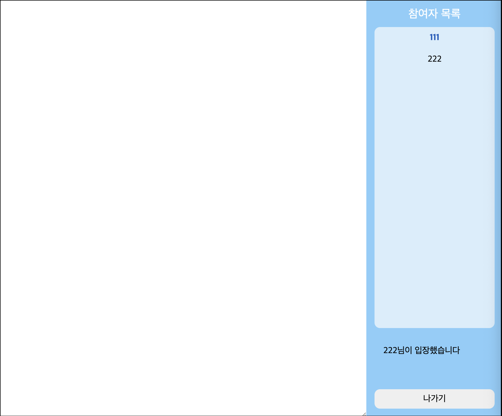
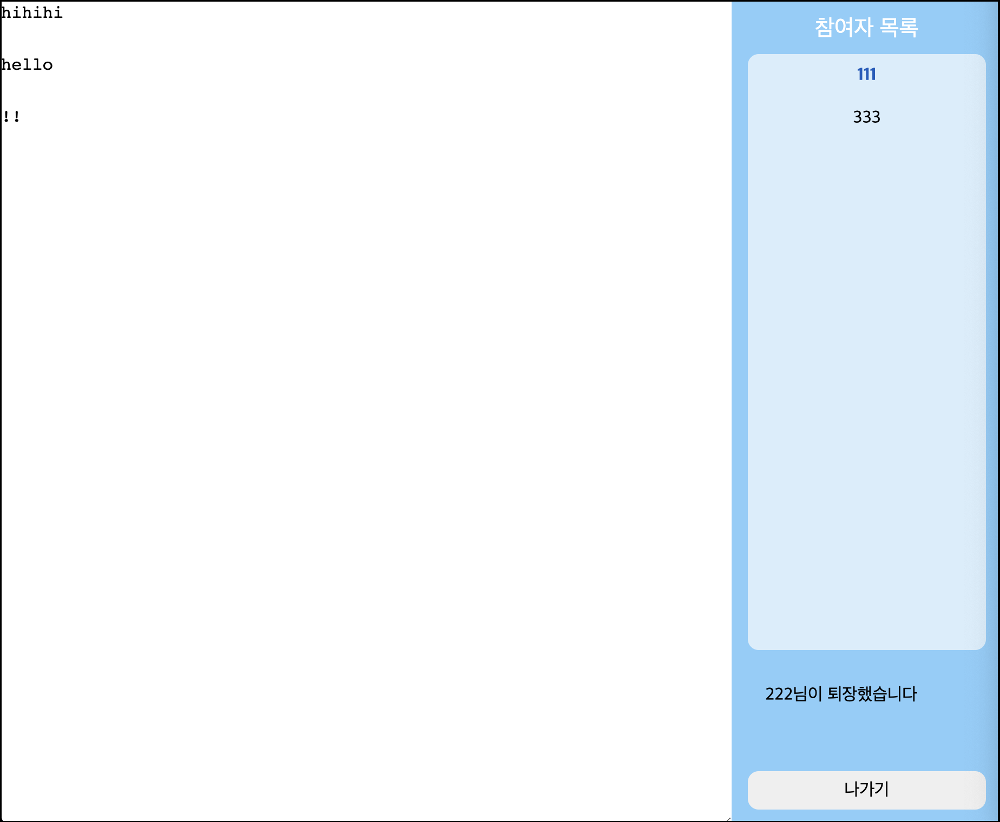
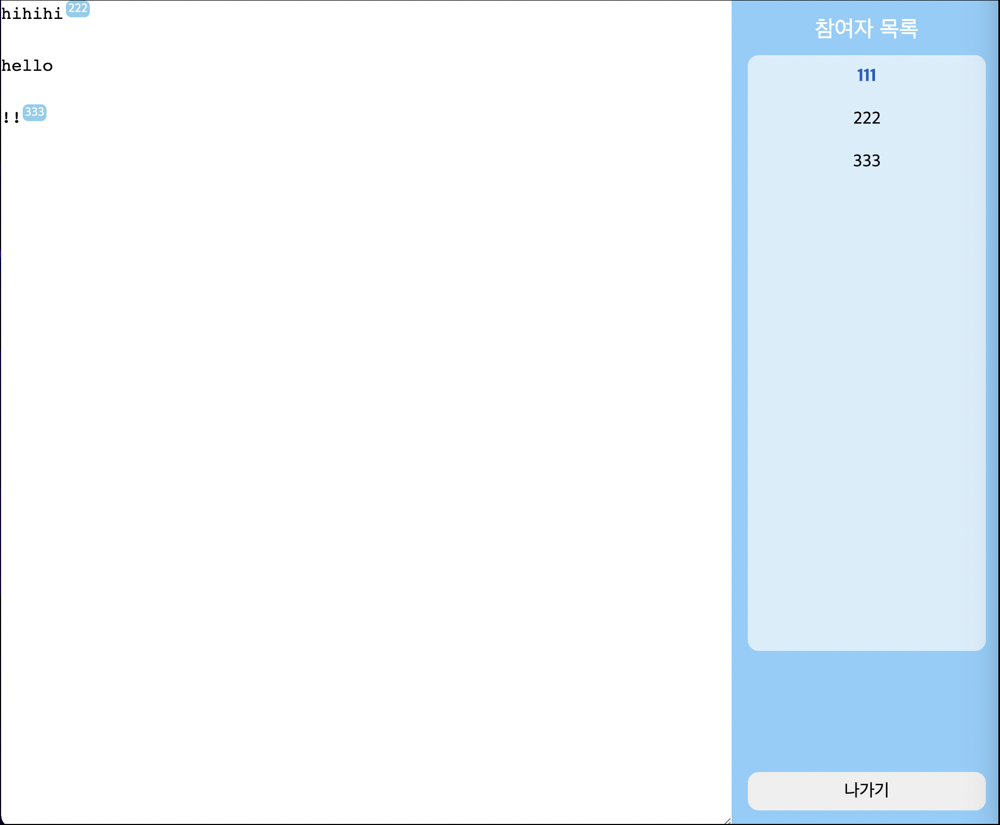

# SPA(Component-Based) with Pure TypeScript
Single Page Application 을 프레임워크나 라이브러리의 도움없이 오직 **TS로만 구현**하여 만든 간단한 에디터 WEB 애플리케이션입니다.<br />
React 아키텍쳐를 모티브로하여 Component형태로 작성하고, 라우팅 방식을 직접 구현했습니다.

Assignment implementation

<br />

## Stack
- TypeScript
- Webpack-dev-server
- Prettier

<br />

## **About Development**
### **Single Page Application**
페이지별로 HTML을 서버에 요청해서 페이지를 그리는 방식이 아니라, 순수 TypeScript 만을 가지고 Client Side Rendering 방식의 Single Page Application을 개발했습니다. **React의 아키텍처**와 유사하게 컴포넌트 단위로 페이지와 구성요소를 만들었으며, Routing기반의 CSR 플로우를 구현했습니다. 그리고 React가 선언적으로 UI를 구축하는 것처럼 뷰를 그리기 위해, 태그에 해당하는 속성·자식 요소를 전달하여 HTML 요소를 생성하는 createElement 함수를 추상화하여 들었습니다. 이를 통해 엘리먼트를 선언적으로 만들 수 있을 뿐만 아니라 가독성과 재사용성을 높일 수 있었습니다. 또한 불필요한 리렌더링을 최소화하기 위해, 동일한 props를 하위 컴포넌트에 전달할 때 같은 레퍼런스를 전달하고, 하위 컴포넌트에 메모이제이션을 적용했습니다.

### **Data Strategy**
브라우저의 웹스토리지 LocalStorage 와 SessionStroage 를 이용해서 데이터를 핸들링했습니다. 
에디터와 유저목록 정보는 새로고침할 때마다 유지가 되어야 하며, 다른 유저가 들어왔을 때에도 기존 데이터를 가져와야 하기 때문에, 서버의 DB 로 간주하고 LocalStorage 를 사용했습니다. 그래서 서버에 보내는 요청과 CRUD 기반의 핸들러들을 분리하여, 추후 실제 API 를 요청하는 로직으로 대체할 수 있게 확장성을 고려해서 작업했습니다. 그리고 유저의 정보는 탭에서만 유지할 수 있도록 클라이언트단의 세션으로 간주하고 SessionStroage 를 사용하여 관리했습니다. 

### Idea Point
- 방의 contents 와 users 정보 및 cursor 정보는 LocalStroage에, user의 정보는 SessionStroage 에 저장했습니다.
- 에디터를 편집할 때마다 유저목록  컴포넌트가 리렌더링되지 않도록, UserList 컴포넌트를 메모아이징하고 props 를 비교하여 불필요한 리렌더링을 방지했습니다.
- 위계에 맞게 컴포넌트 및 파일을 분리하여 개발생산성을 높였습니다.
  <details>
    <summary>디렉토리 구조</summary>
      
        src
         ┣ **api**
         ┃ ┣ handlers
         ┃ ┃ ┣ editor.ts
         ┃ ┃ ┣ room.ts
         ┃ ┃ ┗ user.ts
         ┃ ┗ storages
         ┃ ┃ ┣ client.ts
         ┃ ┃ ┣ server.ts
         ┃ ┃ ┗ stroageKey.ts
         ┃ **components**
         ┃ ┗ Room
         ┃ ┃ ┣ Editor.ts
         ┃ ┃ ┗ UserList.ts
         ┣ **pages**
         ┃ ┣ EnterRoom.ts
         ┃ ┣ Main.ts
         ┃ ┣ NotFound.ts
         ┃ ┗ Room.ts
         ┣ **types**
         ┃ ┗ index.ts
         ┣ **utils**
         ┃ ┣ createElement.ts
         ┃ ┣ createRoot.ts
         ┃ ┣ isPropsEqual.ts
         ┃ ┣ navigate.ts
         ┃ ┗ parse.ts
         ┣ **app.ts**
         ┣ **index.ts**
         ┗ **style.css**
 
  </details>
  


<br />

## Features


|enter|exit|cursor moving|
|---|---|---|
|<div></div>|<div></div>|<div></div>|


<br />

## Specification Details

### 홈 MainPage
- 방만들기를 클릭하면, `/enter-room` 화면으로 이동합니다.
- 이미 개설된 방이 있다면 추가로 방을 개설할 수 없으므로, `방이 이미 존재합니다. 닉네임 설정 페이지로 이동합니다.` 메세지창이 나타나고, `/enter-room` 화면으로 이동합니다.

### 입장하기 EnterRoomPage
- 이름 입력 후, 입장하기 버튼을 클릭하면 `/room` 화면으로 이동합니다.
- 이미 개설된 방이 있다면, 먼저 방에 입장한 유저와 동일한 이름으로는 입장할 수 없습니다. 만약 같은 이름을 입력하고 입장하기 버튼을 클릭 시, `이미 존재하는 이름입니다. 다시 생각해 주세요` 메세지창이 나타납니다.

### 방 RoomPage
`에디터`

- 방은 1개만 존재합니다.
- 방에는 같은 이름을 가진 유저가 존재할 수 없습니다.
- 어떤 유저가 에디터에 컨텐츠를 입력할 때, 모든 유저가 업데이트된 컨텐츠를 볼 수 있어야 합니다.
- 다른 유저가 숫자나 영어를 입력할 때, 화면에 상대 유저의 커서 위치와 유저의 이름이 보여집니다. 
(한글에는 대응이 안되어 있습니다.)
- 복수의 유저가 입력하더라도, 화면에 입력중인 모든 유저의 커서의 위치와 유저의 이름을 확인할 수 있습니다.

`유저목록`

- 유저목록에서 유저 본인의 이름은 바로 알 수 있도록, 이름이 볼드처리되어 보여집니다.
- 입장
    - 모든 유저의 화면의 유저목록 하단에 `000님이 입장했습니다` 메세지가 나타납니다.
    - 한 번 퇴장했다면, 방에 다시 입장할 때 이름을 다시 입력해야 합니다.
    - `/room` URL로 방에 직접 진입하려고 하는 경우, `/enter-room` 화면으로 이동됩니다. 
    이름을 설정해야만 방에 입장할 수 있습니다.
- 퇴장
    - 나가기 버튼을 클릭하면 방에서 퇴장하고, `/enter-room` 화면으로 이동합니다.
    - 방을 퇴장하더라도, 퇴장한 유저가 입력했던 컨텐츠는 에디터에 남아 있어야 합니다.
    - 유저목록이 업데이트됩니다. 업데이트된 목록엔 퇴장 유저의 이름이 없어야 합니다.
    - 다른 유저의 화면의 유저목록 하단에 `000님이 퇴장했습니다` 메세지가 나타납니다.
    - 마지막 남은 유저가 방을 퇴장하게 되면, 방은 사라집니다.
    - 
    </detail>


# Installation


**실행환경**

- Node v16.13.1
- 최신 버전의 Chrome 과 Firefox 에서의 사용을 권장합니다.

**실행 방법**

- 프로젝트 내부에서 패키지를 설치합니다.
    
    ```
    $ yarn
    ```
    
- 로컬 환경에서 개발 서버를 실행합니다.
    
    🔗 URL : [http://localhost:3000](http://localhost:3000/)
    
    ```
    $ yarn dev
    ```
    
<br />
 


